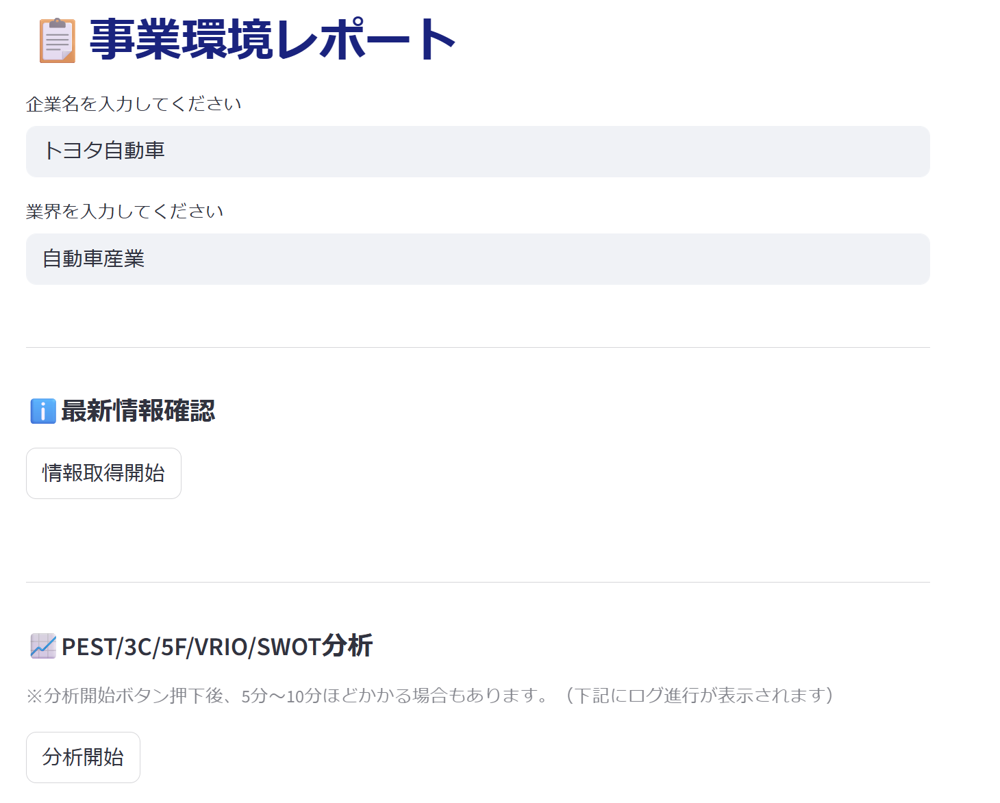
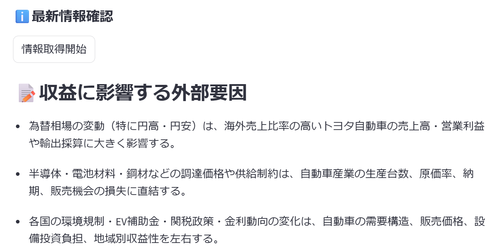
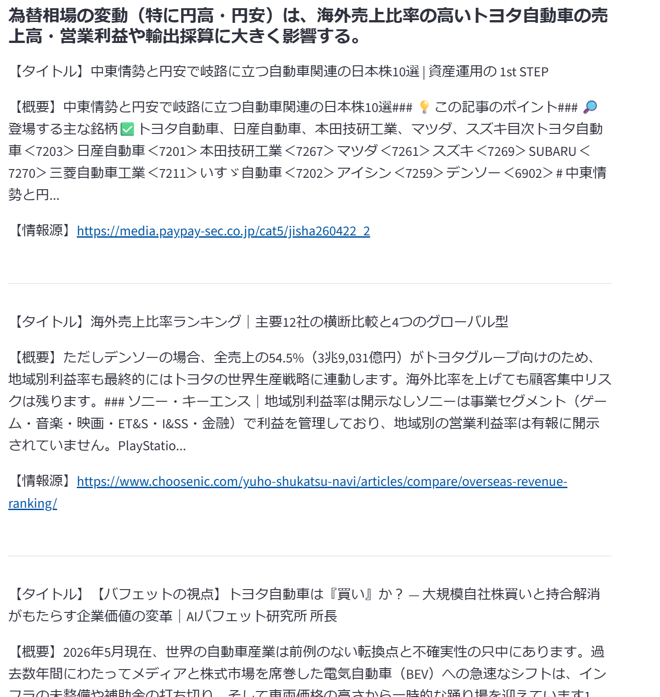
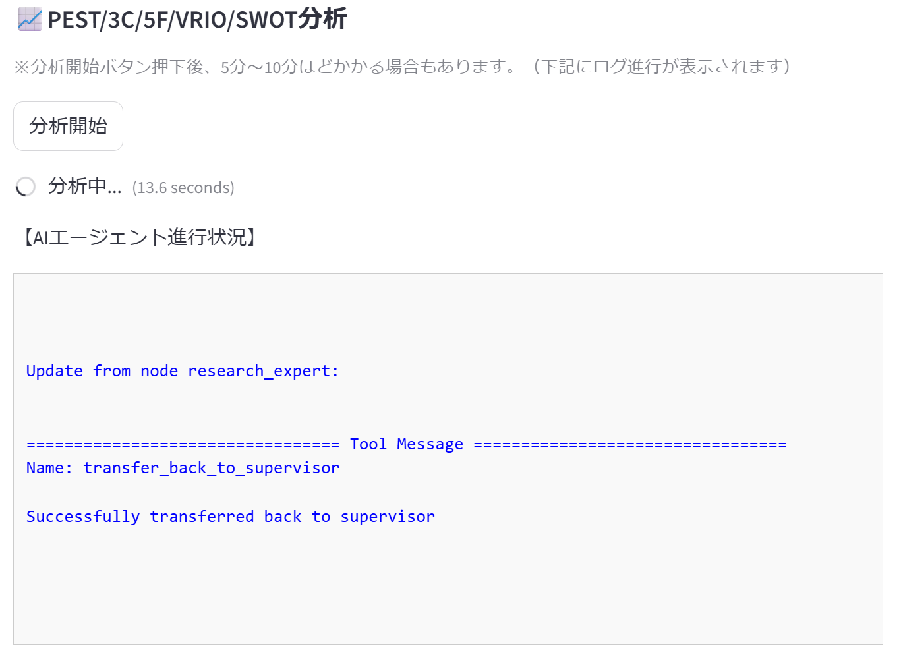
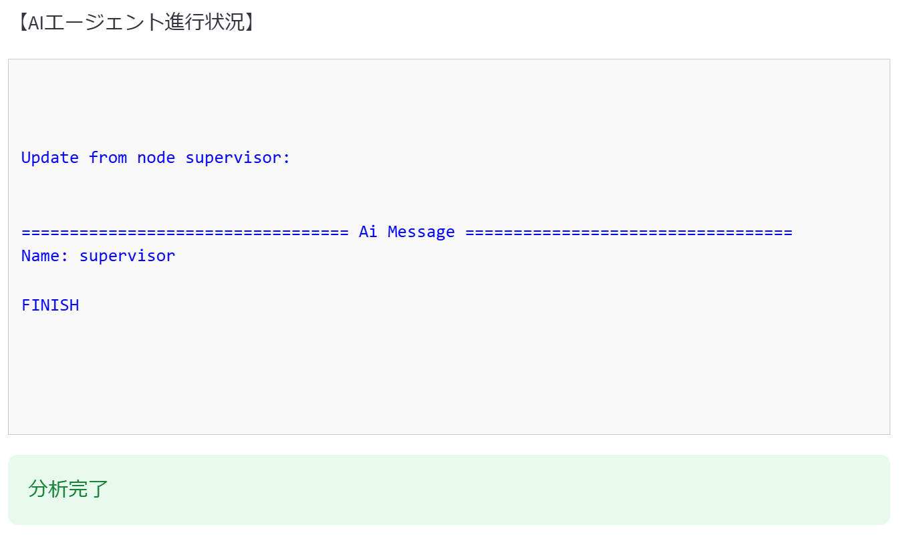
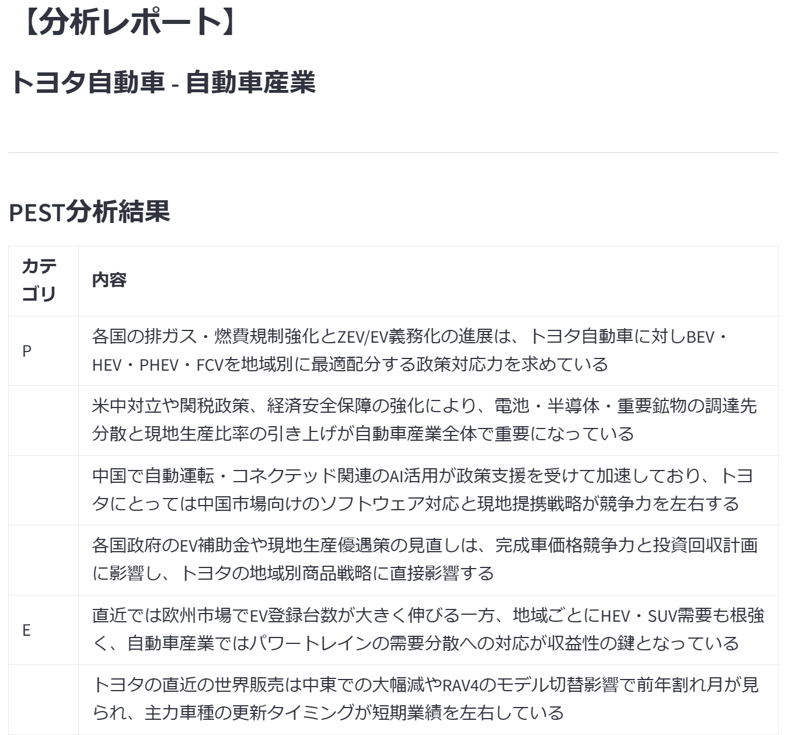
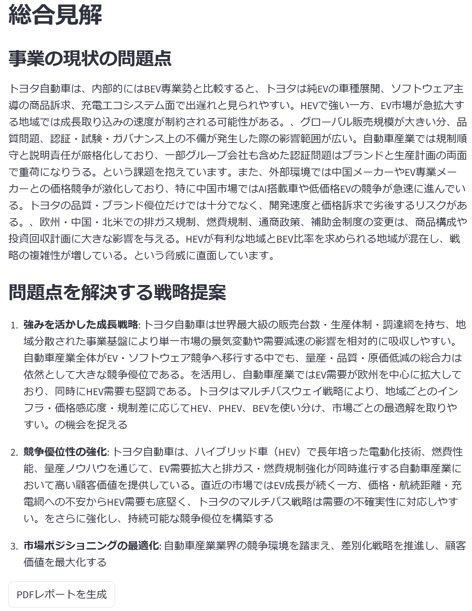
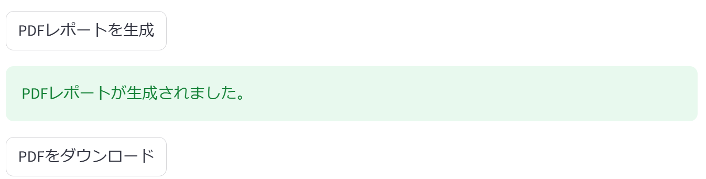

# Supervisor Agent: 事業環境分析レポート生成アプリ

Azure OpenAI と LangGraph Supervisor を利用した、Supervisor型マルチエージェントシステムのサンプルアプリケーションです。  
企業名と業界名を入力すると、Web検索で最新情報を収集し、PEST / 3C / 5F / VRIO / SWOT の各分析エージェントを順番に実行して、事業環境レポートを生成します。

Streamlit によるUI、Tavilyによる外部情報検索、ReportLabによるPDF出力までを一連のワークフローとして実装しています。

## 主な機能

- 企業名・業界名を指定した事業環境分析
- Azure OpenAI を利用した分析要因の抽出
- Tavily Search を利用した関連ニュース・市場情報の取得
- LangGraph Supervisor による複数エージェントの実行管理
- PEST / 3C / 5F / VRIO / SWOT 分析の自動実行
- 分析結果のMarkdownテーブル整形
- Streamlit画面上でのエージェント進行ログ表示
- 日本語フォントに対応したPDFレポート生成

## アーキテクチャ概要

このアプリケーションは、Supervisorエージェントが専門エージェント群を順番に制御する構成です。

```text
Streamlit UI
    |
    | 企業名・業界名を入力
    v
supervisor_app.py
    |
    | AgentRunner を起動
    v
agent_runner.py
    |
    | LangGraph Supervisor
    v
+-------------------------+
| research_expert         | -> Tavilyで最新情報を検索
| pest_analysis_expert    | -> PEST分析
| 3c_analysis_expert      | -> 3C分析
| 5f_analysis_expert      | -> 5F分析
| vrio_analysis_expert    | -> VRIO分析
| swot_analysis_expert    | -> SWOT分析
+-------------------------+
    |
    v
分析レポート生成
    |
    v
Streamlit表示 / PDFダウンロード
```

## 使用技術

- Python 3.12+
- Streamlit
- Azure OpenAI
- LangChain
- LangGraph
- LangGraph Supervisor
- Tavily Search
- ReportLab
- BeautifulSoup4
- Markdown
- PyMuPDF

## 主要ファイル

| ファイル | 役割 |
| --- | --- |
| `supervisor_app.py` | Streamlit UI、Azure OpenAI/Tavily連携、PDF生成、分析結果表示を担当 |
| `agent_runner.py` | LangGraph Supervisor と各専門エージェントの定義・実行制御を担当 |
| `print_for_langchain.py` | LangGraph / LangChain のメッセージを見やすくログ出力する補助モジュール |
| `requirements.txt` | pip向け依存パッケージ一覧 |
| `pyproject.toml` | uv向けプロジェクト定義 |
| `fonts/fonts-japanese-gothic.ttf` | PDF出力時に使用する日本語フォント |

## 処理フロー

1. Streamlit画面で企業名と業界名を入力します。
2. 「情報取得開始」ボタンで、Azure OpenAIが収益に影響する外部要因を抽出します。
3. 抽出した要因をもとに、Tavily Searchで関連する最新情報を取得します。
4. 「分析開始」ボタンで、`AgentRunner` がLangGraph Supervisorを起動します。
5. Supervisorが以下の順番で専門エージェントを呼び出します。
   - `research_expert`
   - `pest_analysis_expert`
   - `3c_analysis_expert`
   - `5f_analysis_expert`
   - `vrio_analysis_expert`
   - `swot_analysis_expert`
6. 各分析結果をMarkdownテーブル形式に整形します。
7. SWOT / VRIO / 5F の結果をもとに総合見解と戦略提案を生成します。
8. 結果を画面に表示し、必要に応じてPDFとしてダウンロードできます。

## セットアップ

### 1. リポジトリを取得

```bash
git clone <repository-url>
cd poc-006-langgraph-supervisor-multiagent
```

### 2. 依存関係をインストール

uvを利用する場合:

```bash
uv add -r requirements.txt
```


### 3. 環境変数を設定

プロジェクトルートに `.env` を作成し、以下を設定します。

```env
AZURE_OPENAI_ENDPOINT=your_azure_openai_endpoint
AZURE_OPENAI_API_KEY=your_azure_openai_api_key
AZURE_OPENAI_DEPLOYMENT_MODEL_NAME=your_deployment_name
AZURE_OPENAI_API_VERSION=your_api_version
TAVILY_API_KEY=your_tavily_api_key
```

## 実行方法

uvを利用する場合:

```bash
uv run streamlit run supervisor_app.py --server.address 0.0.0.0
```

起動後、ブラウザで表示されたStreamlitのURLにアクセスします。


## 実装上のポイント

### Supervisorによる実行順序制御

`agent_runner.py` では、LangGraph Supervisorが6つの専門エージェントを管理します。  
`completed_agents` に完了済みエージェントを記録し、未実行のエージェントが残っている場合は処理を継続するようにしています。

### 共有データストア

検索結果や各分析結果は `shared_data` に格納されます。  
後続の分析エージェントは、先に収集された検索結果を参照して分析を行います。

### JSONパースとフォールバック

各分析ツールでは、Azure OpenAIからJSON配列形式の回答を受け取り、Pythonのリストとして扱います。  
JSONとして解釈できない場合や例外が発生した場合でも、最低限の分析結果を返すフォールバックを用意しています。

### PDF生成

`supervisor_app.py` の `generate_pdf()` では、Markdown形式の分析結果をHTMLに変換し、ReportLabでPDFを生成します。  
日本語表示のため、`fonts/fonts-japanese-gothic.ttf` を登録して使用しています。

### ログ表示

`print_for_langchain.py` でLangGraphのストリーミング更新を整形し、Streamlit画面上にエージェントの進行状況として表示します。  
ANSIエスケープシーケンスを除去することで、画面表示時の文字化けや制御文字の混入を抑制しています。

## 注意事項

- Azure OpenAIのエンドポイント,APIキー と Tavily のAPIキーが必要です。
- Web検索結果はTavily APIの検索条件や取得タイミングに依存します。
- 分析結果はLLMによる生成結果であり、最終的な意思決定には人による確認が必要です。
- 初回実行や分析対象によっては、分析完了まで数分かかる場合があります。

## 今後の改善候補

- 分析結果の保存機能
- 検索結果の引用元管理の強化


## 画面

#### 初期画面


---

#### 情報取得後画面(外部要因)


---

#### 情報取得後画面(検索結果)


---

#### 分析画面(処理中)


---

#### 分析画面(完了)



---

#### 解析結果画面

:  
中略  
:  



---

#### PDFダウンロード
